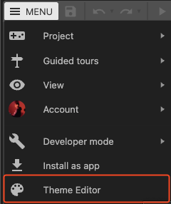
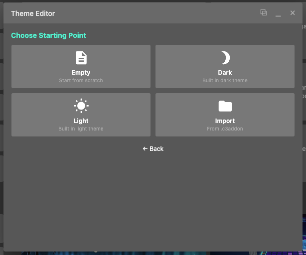
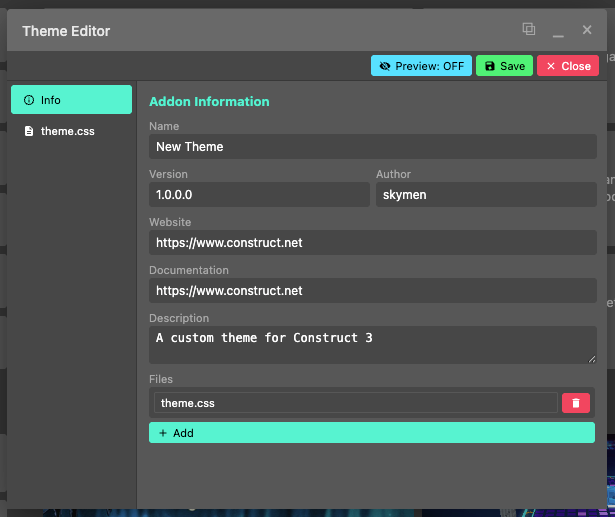

# Getting Started with CAW Theme Creator

Welcome to the CAW Theme Creator! This guide will help you get started with creating custom themes for Construct.

## Prerequisite

You don't need to add this addon to a project, just having it installed is enough!

## Creating Your First Theme

### Step 1: Open the Theme Editor Menu

The addon adds a new button in the main menu

Once opened, it opens a new editor window that looks like this:

### Step 2: Create a new project, and chose your base

The theme editor comes with a copy of the built in light mode and dark mode if you just want to extend them.

Alternatively you can also start from scratch, or you can import a different c3addon theme addon and it will copy its content.

### Step 3: Fill in the addon info

Once a project is open, you can fill in some info about your addon. By default the editor will automatically fill the author name to your Construct 3 account name, and will fill the rest with default info.

You can also create as many css files as you want for better organisation

### Step 4: Preview the changes and export

At any point, you can preview your css changes.
The preview will not be perfect however since Construct 3 changes the UI based on the theme on startup, but it should be good enough to have a quick idea of how it will look like.

Once you're done, hit save and it will prompt you to name the file. Future saves will keep saving to the same file

## Modifying other themes

Since the Theme Editor loads and saves directly to and from c3addon files, you can also load any other theme addon made by anyone else, or you can create new themes based on a c3addon someone else made

## Closing the project

The theme editor keeps in memory the state of the current project, even after a refresh. When you're done making the addon, make sure to close the project so the theme editor can clear its memory safely.
